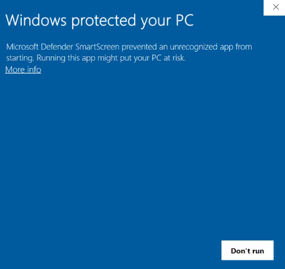

# Project: Nine Men's Morris Application
**FIT3077 Software Engineering: Architecture and Design**  
By Team 5: Gan Jia Horng | Ravindu Santhush Ratnayake | Danesh Carmel Domingo Mariapan

## Sprint 2 Executable
_For Sprint 3 executable, see the below section._

Run the program `morris.jar` on a Windows platform. 

The executable requires minimum JDK 19 to run. Please ensure the correct
version is in your PATH variable. Use your terminal to check the environment version of Java
and ensure it is at least 19.

If you see the above message when opening the executable,
click <u>More Info</u> and click <u>Run Anyway</u>

JDK 19 Download:https://www.oracle.com/java/technologies/javase/jdk19-archive-downloads.html

---

## Sprint 3
### Sprint 3 Submission
**Design Rationale and diagrams**: `docs/Sprint 3/sprint3.pdf`

## Setup Guide

To run the project, the user can either build or 
just run the pre-compiled executable in the repository.
### Compiled Sprint 3 executable
Prerequisites: Windows 10 OS is required for the game to run. 

The executable is self-contained and able 
to run without any other dependencies. It is under the directory `.\game\game.exe`.
Ignore the other files.

If you see the above message when opening the executable,
click <u>More Info</u> and click <u>Run Anyway</u>

### Building the executable
Prerequisites: IntelliJ, Minimum version of Java JDK 19

The executable requires minimum JDK 19 to run. Please ensure the correct
version is in your PATH variable. Use your terminal to check the environment version of Java
and ensure it is at least 19.

JDK 19 Download:https://www.oracle.com/java/technologies/javase/jdk19-archive-downloads.html

For windows: To add to the Path manually, locate
the directory where JDK 19 is installed. Go to Menu > Edit the system environment variables >
Environment Variables... Select Path and add another directory of the form
`<YOUR DIRECTORY>\Java\jdk-19\bin\`.

### Steps
1. Download and install **JDK 19** and **IntelliJ IDE** on your system.
2. Download or Clone the Project Repository  
   Project Link: https://git.infotech.monash.edu/fit3077-s1-2023/MA_Friday2pm_Team5/project  
3. In IntelliJ, navigate to the location of the cloned repository and open `.\morris\pom.xml`. Select
`Open as Project` at the prompt.
4. Go to File > project structure. Under the project tab make sure that for SDK at least version 19 is selected.
5. Go to `project\src\main\java\com.nineman.morris\MenuApplication.java` and run the static `main` function to 
build and launch the Application.

## Game Instructions

**Current State of implementation:**
1. Player is able to place, move, and jump tokens according to the game rules.
   1. To place a token, click on any empty position. 
   2. To move a token, click on 1 of your token, proceeded by the adjacent empty position that you want to move.
      1. If an invalid token is pressed anytime in the process
      (e.g. Selecting opposing token color to move/ Move to occupied position)
      the initial token to move has to be reselected again.
   3. To jump a token, click on 1 of your token, proceeded by any empty positions that you want to move.
      1. If an invalid token is pressed anytime in the process
         (e.g. Selecting opposing token color to jump/ Jump to occupied position)
         the initial token to jump has to be reselected again.
3. When a mill is formed, the player can remove another player's token
that is not part of a mill or any of it if all of them are a mill. 
The turn indicator will not alternate the player's turn.