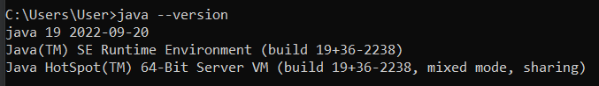

# Project: Nine Men's Morris Application
**FIT3077 Software Engineering: Architecture and Design**  
By Team 5: Gan Jia Horng | Ravindu Santhush Ratnayake | Danesh Carmel Domingo Mariapan

### Sprint 2 Executable
Run the program `morris.jar`. The executable requires minimum JDK 19 to run. Please ensure the correct
version is in your PATH variable. Use your terminal to check the environment version of Java
and ensure it is at least 19.

### Sprint 3 Submission
**Design Rationale and diagrams**: `docs/Sprint 3/sprint3.pdf`

---
## Setup Guide

To run the project, the user can either build or 
just run the pre-compiled executable in the repository.
### Compiled Sprint 3 executable
Prerequisites: Windows 10 OS is required for the game to run. 

The executable is self-contained and able 
to run without any other dependencies. It is under the directory `./game/???.exe`.

### Building the executable
Prerequisites: IntelliJ, Minimum version of Java JDK 19

The executable requires minimum JDK 19 to run. Please ensure the correct
version is in your PATH variable. Use your terminal to check the environment version of Java
and ensure it is at least 19.

JDK 19 Download:https://www.oracle.com/java/technologies/javase/jdk19-archive-downloads.html

For windows: To add to the Path manually, locate
the directory where JDK 19 is installed. Go to Menu > Edit the system environment variables >
Environment Variables... Select Path and add another directory of the form
`<YOUR DIRECTORY>\Java\jdk-19\bin\`.

### Steps
1. Download and install **JDK 19** and **IntelliJ IDE** on your system.
2. Download or Clone the Project Repository  
   Project Link: https://git.infotech.monash.edu/fit3077-s1-2023/MA_Friday2pm_Team5/project  
3. In IntelliJ, navigate to the location of the cloned repository is cloned and open `project\morris\pom.xml`. Select
`Open as Project` at the prompt.
4. Go to File > project structure. Under the project tab make sure that for SDK at least version 19 is selected.
5. Go to `project\src\main\java\com.nineman.morris\MenuApplication.java` and run the static `main` function to launch the Application.

## Game Instructions

**Current State of implementation:**
1. Player is able to place, move, and jump tokens according to the game rules.
   1. To place a token, click on any empty position. 
   2. To move a token, click on 1 of your token, then the adjacent empty position that you want to move.
      1. If an invalid token is pressed anytime in the process
      (e.g. Selecting opposing token color to move/ Move to occupied position)
      the initial token to move has to be reselected again.
   3. To jump a token, click on 1 of your token, then any empty position that you want to move.
      1. If an invalid token is pressed anytime in the process
         (e.g. Selecting opposing token color to jump/ Jump to occupied position)
         the initial token to jump has to be reselected again.
3. When a mill is formed, the player can remove another player's token
that is not part of a mill or any of it if all of them are a mill. 
The turn indicator will not alternate the player's turn.

[//]: # (***Game Objective:**  )

[//]: # (The game ends and you are the WINNER when you have reduced your opponent to only)

[//]: # (two &#40;2&#41; tokens or when the opponent can no longer make any valid moves on the board.  )

[//]: # (This is achieved by trying to create "mills" &#40;three &#40;3&#41; tokens in a row&#41; to remove the opponents tokens from the board)

[//]: # (while preventing the opponent from doing the same.*)

[//]: # ()
[//]: # (**Initial Phase:**  )

[//]: # (Each player takes turns placing nine &#40;9&#41; of their own respective tokens on the board.  )

[//]: # (Players can only place their tokens on vacant / empty positions on the board.  )

[//]: # (The goal is to position your tokens well so that it sets you up for success in the upcoming phases.  )

[//]: # (*Click a vacant location on the board when the display shows it is your turn*)

[//]: # (1. Player 1 &#40;White&#41; places a token)

[//]: # (2. Player 2 &#40;Black&#41; places a token)

[//]: # (3. The cycle repeats until both players have nine &#40;9&#41; tokens each on the board)

[//]: # ()
[//]: # (**Mid-Game Phase**  )

[//]: # (Players take turns moving their tokens along the lines on the board.)

[//]: # (When a player forms a mill &#40;three &#40;3&#41; tokens in a row&#41;, he/she removes one of the opponent's tokens from the board.  )

[//]: # (The Mid-Game Phase ends when a player is reduced to only three &#40;3&#41; tokens on the board  )

[//]: # (1. Player 1 &#40;White&#41; selects his/her token on the board)

[//]: # (2. Player 1 &#40;White&#41; selects a valid move for their token to move to)

[//]: # (3. Player 2 &#40;Black&#41; selects his/her token on the board)

[//]: # (4. Player 2 &#40;Black&#41; selects a valid move for their token to move to)

[//]: # (5. The cycle repeats)

[//]: # (6. If an invalid move is made, the player has to re-select a token again &#40;from Step 1&#41;)

[//]: # ()
[//]: # (*Forming Mills:*)

[//]: # (1. Player 1 &#40;White&#41; places moves a token that forms a mill)

[//]: # (2. Player 1 &#40;White&#41; selects an opponents token to remove &#40;Black&#41;)

[//]: # (3. Player 2's &#40;Black&#41; turn to move)

[//]: # (4. The cycle repeats)

[//]: # ()
[//]: # (**End-Game Phase**  )

[//]: # (Players who are reduced to only three &#40;3&#41; tokens can jump a token to any vacant position on the board.  )

[//]: # (The game ends when a player is reduced to only two &#40;2&#41; tokens or is unable to move.  )

[//]: # (The opposing player is then declared as the winner.  )

[//]: # (1. Player 1 &#40;White&#41; creates a mill and removes an opponent's token)

[//]: # (2. Player 2 &#40;Black&#41; is reduced to two tokens - the game ends)

[//]: # (3. Player 1 &#40;White&#41; wins)

[//]: # (---)